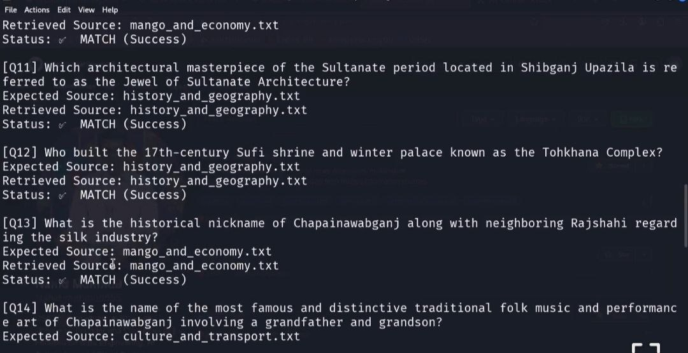

# 🚀 Day-01: Local RAG Pipeline, Golden Dataset & Core Concepts

Welcome to **Day-01** of my **AI & Data Engineering Roadmap**! Today's milestone focuses on building a local Information Retrieval and Retrieval-Augmented Generation (RAG) evaluation pipeline from scratch, enforcing strict zero-hallucination guardrails, provenance tracking, and foundational system design principles.

---

## 🧠 Core Architecture Concepts Mastered Today

Here are the foundational building blocks and architectural terms I implemented and studied today:

1. **Retrieval Contract (রিট্রিভাল কন্ট্রাক্ট):**  
   A strict set of system promises made by a retrieval engine—defining precisely what types of questions it can answer, which authorized sources it will draw from, its data freshness SLA, and the required level of provenance or evidence citation.

2. **Parametric Memory (প্যারামেট্রিক মেমোরি):**  
   The internal knowledge stored within an LLM's weights and parameters—it operates fast but is static/fixed, its exact sources cannot be tracked natively, and updating it requires costly retraining or fine-tuning.

3. **Non-parametric Memory (নন-প্যারামেট্রিক মেমোরি):**  
   External, dynamic knowledge stored in an index or vector database that the model reads at query time—it is easily updateable, fully traceable to its original source, and simple to audit.

4. **Grounding (গ্রাউন্ডিং):**  
   The mechanism of constraining an LLM's generated output strictly to the retrieved context or evidence, ensuring that every claim or answer can be directly traced back to a verified source.

5. **Corpus (কর্পাস):**  
   The controlled, governed, and curated collection of documents from which a retrieval system is legally and operationally authorized to fetch answers.

---

## 🛠️ Step-by-Step Practical Execution

1. **Corpus Selection:** Curated real local domain data (Chapai-Intel knowledge base covering history, geography, economy, culture, and mango ecosystems).

2. **Golden Dataset Curation:** Built a benchmark of **20 real user queries** (`questions.jsonl`) mapping complex lookups and multi-hop inquiries to their ground-truth source files.

3. **Retrieval Contract Design:** Defined system boundaries, operational scope, freshness SLAs, and provenance tracking rules.

4. **Repository & Environment Setup:** Initialized version control (`git init`), established a modular project directory (`day_01/`), and configured local python execution environments.

5. **Evaluation Script Engineering:** Developed a deterministic Python search pipeline (`search.py`) to automate retrieval validation.

---

<p align="center">
  <a href="https://youtu.be/HJRp_cPPA_8" target="_blank">
    
  </a>
</p>
<p align="center">
  <strong>Accuracy Rate: 100%</strong><br>
  <a href="https://youtu.be/HJRp_cPPA_8" target="_blank">📺 Watch Day-01 Implementation on YouTube</a>
</p>


## 📊 Verification & Evaluation Results

The custom Python evaluation script successfully verified **100% match accuracy** across all benchmark queries, proving the deterministic robustness of the local retrieval pipeline:

- **Total Queries Evaluated:** 20
- **Successful Matches:** 20 ✅
- **Accuracy Rate:** 100%

---

## 💻 Terminal Commands Used Today

### 1. Environment & Directory Setup

```bash
cd ~/Documents
mkdir chapai-intel-rag && cd chapai-intel-rag
ls
```

### 2. File Creation & Execution

```bash
nano search.py
nano questions.jsonl
python3 search.py
```

### 3. Git & GitHub Workflow

```bash
git init
git add .
git commit -m "Add Day-01: Core RAG concepts, corpus, golden set, and evaluation script"
git branch -M main
git remote add origin https://github.com/nahid-mahmud555/ai-data-engineering-roadmap.git
git push -u origin main
```

---

## 📂 Project Structure (Day-01)

```plaintext
day_01/
├── corpus/
│   ├── history_and_geography.txt
│   ├── mango_and_economy.txt
│   └── culture_and_transport.txt
├── questions.jsonl
├── search.py
└── README.md
```

---

## 📚 Reading & Research Bibliography

### RAG Fundamentals

- Retrieval-Augmented Generation from First Principles.

### Foundational Papers

- Retrieval-Augmented Generation for Knowledge-Intensive NLP Tasks (Lewis et al., 2020).

- Retrieval-Augmented Generation for Large Language Models: A Survey (Gao et al., 2023).

### Data Engineering Foundation

- Fundamentals of Data Engineering (Joe Reis & Matt Housley).

---

**Maintained by Nahid Mahmud**
