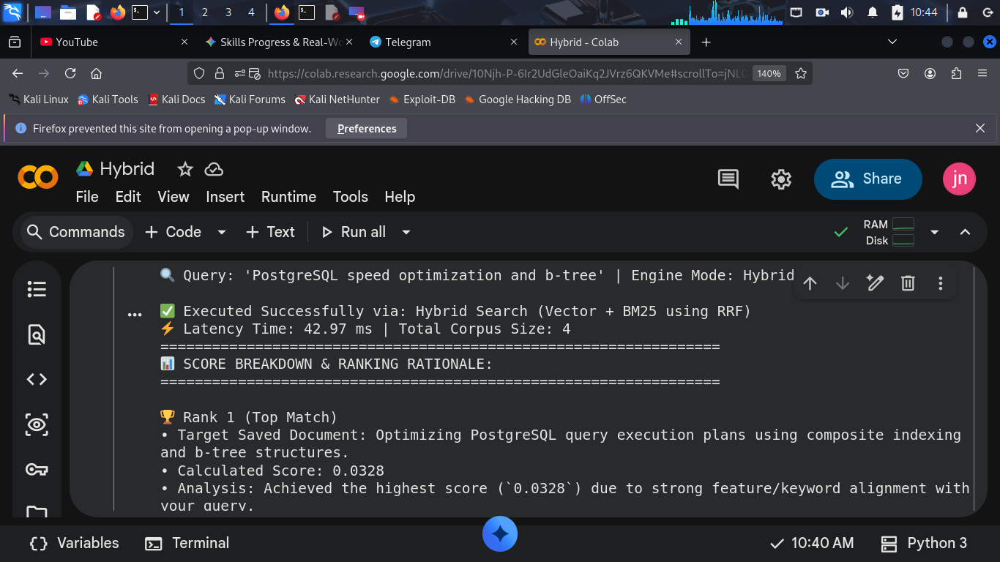
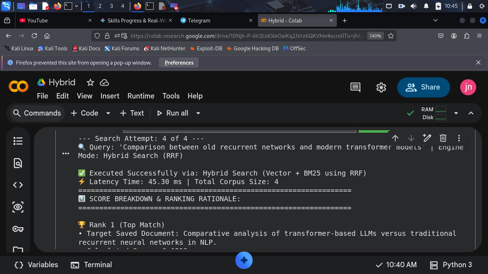
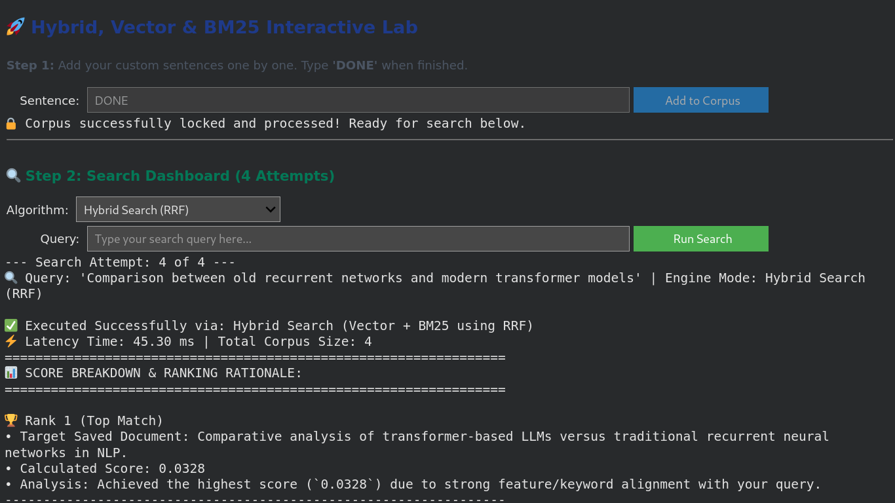

# 🚀 Hybrid Search Engine Lab: Vector vs. BM25 vs. Hybrid (RRF)

An interactive practical lab and implementation demonstrating the comparison and combination of **Lexical Search (BM25)**, **Semantic Search (Vector Embeddings)**, and **Hybrid Search** using **Reciprocal Rank Fusion (RRF)** in Python. ok

---

## 📖 What is This Project About?
When building search systems, developers generally face a choice:
1. **Should we search by exact keywords?** (Traditional approach)
2. **Should we search by meaning/context?** (AI/Semantic approach)

This project builds a custom corpus pipeline where you can test, compare, and understand how **BM25**, **Vector Search**, and **Hybrid Search** behave under different types of queries.

---

## 🧠 Core Concepts Explained

### 1. BM25 (Keyword / Lexical Search)
* **What it is:** A ranking function used by search engines to estimate the relevance of documents to a given search query based on the **exact matching of keywords and terms**.
* **Best for:** Finding specific IDs, error codes, version numbers, or exact technical terms (e.g., `CVE-2024-8891`).

### 2. Vector Search (Semantic Search)
* **What it is:** An AI-powered search technique that converts text into numerical representations (**embeddings**) using transformer models (`all-MiniLM-L6-v2`). It captures the **underlying meaning, intent, and context** of the text.
* **Best for:** Understanding conceptual queries where exact keywords might not match (e.g., searching for "backend protection" when the text says "security patch").

### 3. Hybrid Search (RRF - Reciprocal Rank Fusion)
* **What it is:** The ultimate combination of both worlds. It merges the results of BM25 and Vector Search using **Reciprocal Rank Fusion**, balancing strict keyword matching with deep semantic understanding.
* **Best for:** Production-grade search engines that require high precision and context awareness.

---

## 🛠️ How We Built & Tested It (Workflow)

1. **Custom Corpus Ingestion:**
   * Users input their own custom documents/sentences one by one.
   * Typing `DONE` locks the corpus repository and initializes the AI embedding model.
2. **Multi-Algorithm Evaluation:**
   * The system evaluates queries across 4 interactive attempts.
   * It calculates scores, execution latency (in milliseconds), and provides detailed positional rationales (why a document ranked #1 vs. lower).

---

## 📊 Sample Test Results & Analysis

| Attempt | Query Type | Selected Engine | Top Match Result | Why it Ranked #1 |
| :--- | :--- | :--- | :--- | :--- |
| **1** | Conceptual | Vector Search | Security Patch Module | Understood the semantic intent of backend protection. |
| **2** | Exact Code | BM25 Search | `CVE-2024-8891` | Matched the exact keyword string with high precision score. |
| **3** | Database | Hybrid (RRF) | PostgreSQL Optimization | Balanced keyword tags (`PostgreSQL`, `b-tree`) and context. |
| **4** | NLP/AI | Hybrid (RRF) | Transformer vs. RNN | Merged semantic similarity with lexical term matches. |

---

## 🎥 Demonstration & Article
Check out the full lab walkthrough and read the detailed article below:
* [**🎥 Watch the Demo on YouTube**](https://youtu.be/OBLi92MXe4k)
* [**✍️ Read the Hashnode Article**](https://nahid-mahmud555.hashnode.dev/building-a-hybrid-search-engine-from-scratch-combining-bm25-vector-search-and-rrf?utm_source=hashnode&utm_medium=feed)

---

## 📸 Lab Visuals & Interface
Here is how the search engine lab looks and performs:

| Corpus Input Interface | Search Execution | Detailed Ranking Breakdown |
| :---: | :---: | :---: |
|  |  |  |

---

## 💻 Tech Stack Used
* **Python** 🐍
* **Streamlit** (for interactive web dashboard) / **IPyWidgets** (for Colab execution)
* **Sentence-Transformers** (`all-MiniLM-L6-v2` for embeddings)
* **Rank-BM25** (for lexical token scoring)
* **NumPy** (for similarity and RRF matrix calculations)

---
