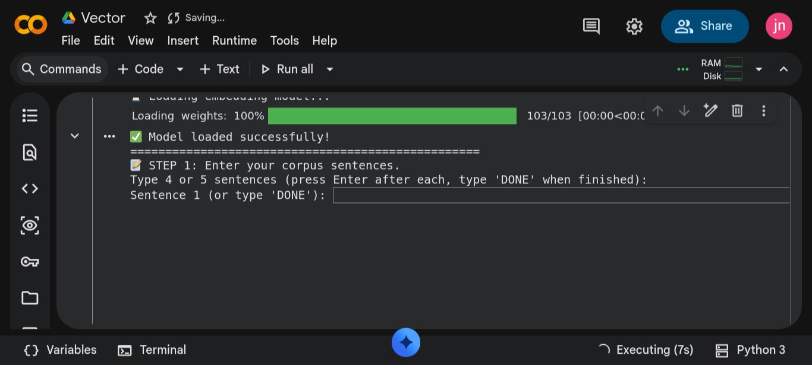
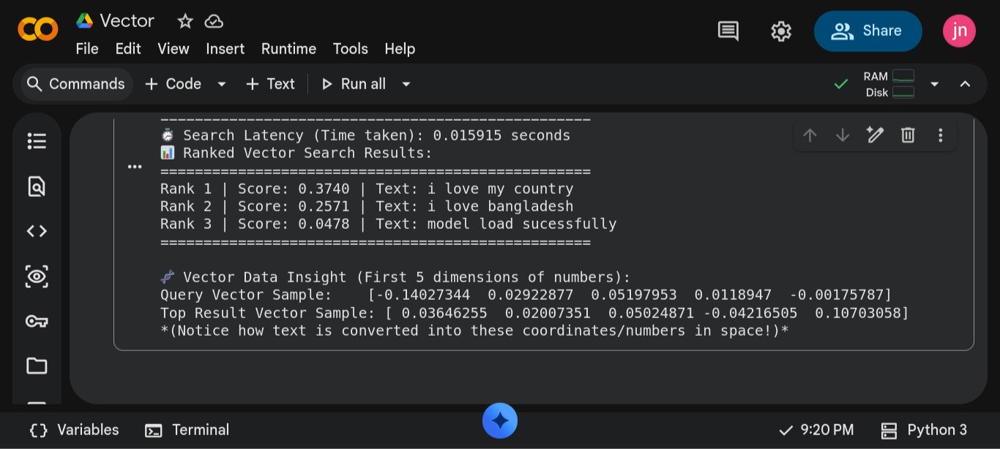
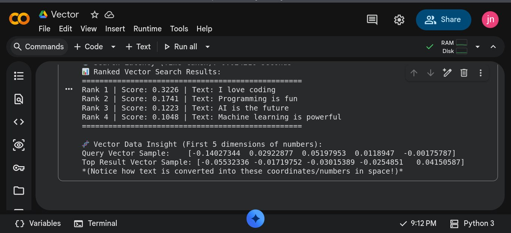

# 🚀 Vector Space Explorer & Semantic Search Core

A hands-on Python implementation to understand the core mechanics of **Vector Search**, **Embeddings**, and **Semantic Similarity**. This project bypasses heavy UI frameworks to focus purely on the underlying mathematical engine of modern AI search systems.

---

## 🧠 What is Vector Search? (Core Concept)
Traditional search engines (like Ctrl+F or SQL LIKE) look for exact keyword matches. In contrast, **Vector Search** understands the **context, meaning, and intent** behind human language:
1. **Text-to-Vector (Embeddings):** Converts sentences or queries into high-dimensional numerical coordinates (using `sentence-transformers` and the `all-MiniLM-L6-v2` model, where each sentence maps to a 384-dimensional space).
2. **Spatial Proximity:** Treats text as points in a multi-dimensional space.
3. **Cosine Distance & Scoring:** Calculates the angular distance between the query vector and corpus vectors. The closer the points, the higher the similarity score (scaled from $0$ to $1$).

---

## 🛠️ What We Did (Step-by-Step Implementation)

1. **Model Initialization:** Loaded the pre-trained embedding model (`all-MiniLM-L6-v2`) locally to process text without external API dependencies.
2. **Corpus Ingestion:** Inputted custom text sentences to form our searchable database.
3. **Embedding Generation:** Transformed text chunks into spatial coordinates and measured processing time (sub-second performance benchmarking).
4. **Query Execution & Ranking:** Provided a custom search query, converted it into a vector, and computed cosine distances against the corpus.
5. **Score & Matrix Analysis:** Sorted results dynamically by highest similarity rank and inspected raw numerical dimensions (e.g., the first 5 axes of the 384-dimensional space) to observe how AI views text as math.

---

## 📊 Sample Output & Insights

When testing with a custom corpus and query (e.g., searching for `"love"` among sentences like `"i love my country"`, `"i love bangladesh"`, and `"model load successfully"`), the system successfully:
* Bypassed literal keyword limitations to rank sentences based on semantic depth.
* Calculated precise similarity scores (e.g., Rank 1 with a higher score for contextual proximity).
* Displayed raw coordinate arrays, proving how text is translated into spatial math.

---

---

## 📸 Project Execution & Visual Proofs

Here are some snapshots of the code running successfully and displaying vector metrics, similarity scores, and dimensional data:

  
  
  

---

---

## 🔗 Project Resources & Read More

If you want to dive deeper into the concepts or see the code in action, check out these links:

*   **📖 Read the Full Article:** [Demystifying Vector Search - Hashnode](https://nahid-mahmud555.hashnode.dev/how-computers-read-and-match-text-a-quick-vector-search-experiment?utm_source=hashnode&utm_medium=feed)
*   **🎥 Watch the Demo:** [Vector Search in Action - YouTube](https://youtu.be/HEPmlnrMXW8?si=6ofAATosXB86EzB3)

---

## 💻 Tech Stack & Libraries
* **Python**
* **Sentence-Transformers** (for generating AI embeddings)
* **NumPy** (for array operations and sorting)
* **SciPy** (for calculating cosine distances)
